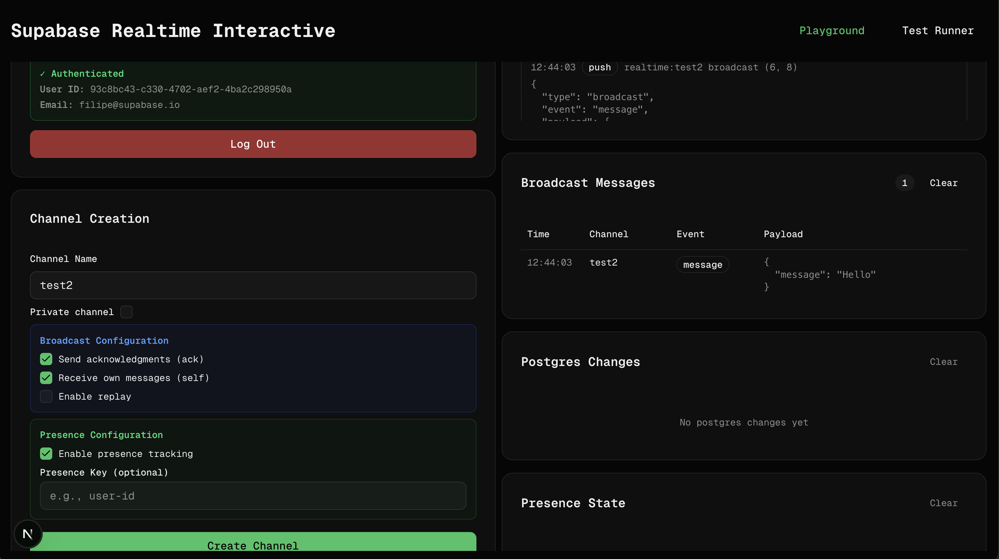
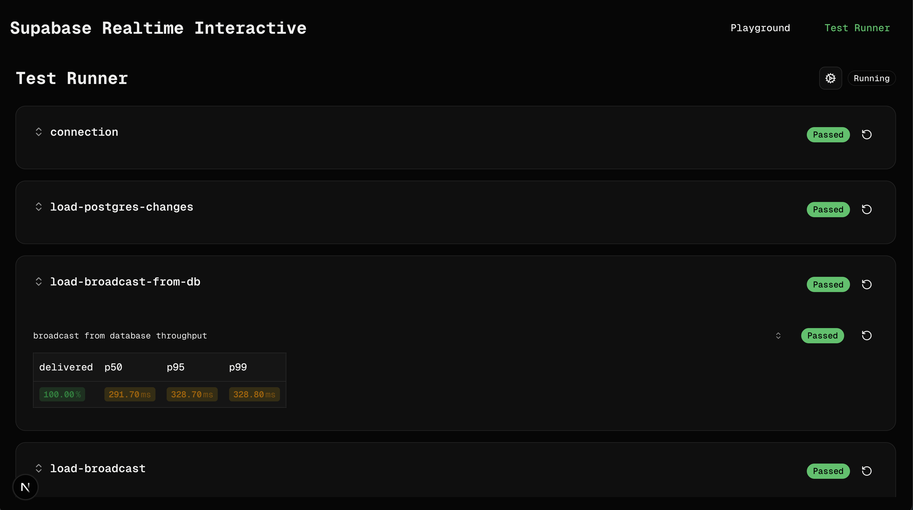
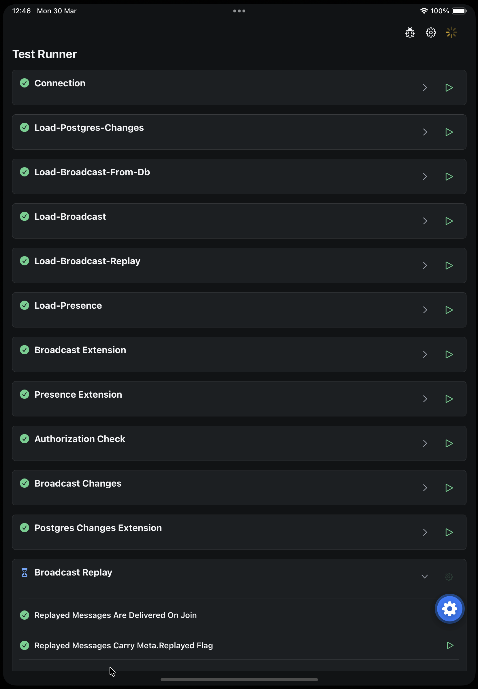
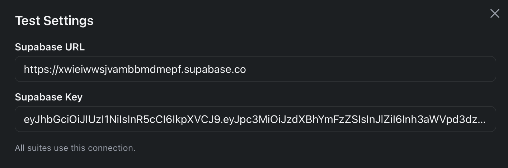
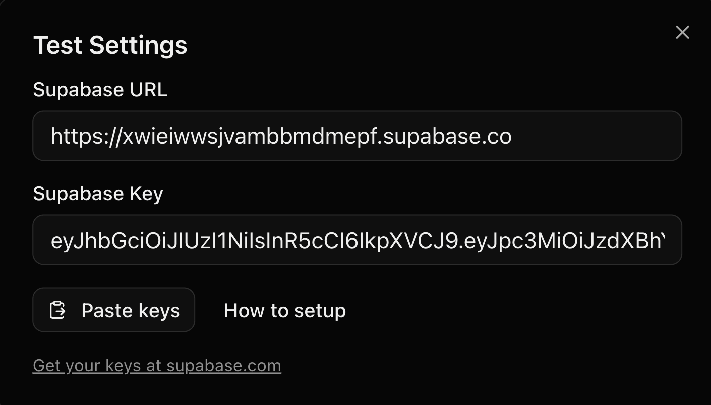

an you # Realtime Playground and Test Runner

Sandbox playground for manual and E2E tests run in browser.

### Playground



### Test Runner in browser



### Test Runner on mobile



## Structure

- `apps/next`: Next.js playground and test runner UI
- `apps/expo`: Expo playground and test runner UI
- `packages/realtime-core`: shared realtime controller, collectors, types, and schemas
- `packages/tests`: shared realtime test suites and test runner helpers

## Installation

1. Copy `example.env` to `.env`
2. Run `yarn install`

3. Run web, mobile or both apps

```bash
yarn web # runs web dev client
yarn ios # runs ios mobile client
yarn android # runs android mobile client
yarn dev # runs both web and mobile servers and starts ios simulator
```

Both `apps/next` and `apps/expo` load environment variables from the repo root `.env`.

## Change project secrets

To change secrets in order to test different project use `Test Settings` on mobile or browser





